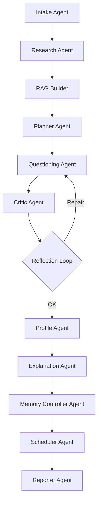

# 🧠 KeplerMind Agents

## Overview

**KeplerMind** is an *agentic learning and reasoning system* built around the MCP (Memory · Control · Planning) paradigm.
It uses multiple specialized agents orchestrated via LangGraph, each operating as a node with its own goal, tools, and reflection policy.

At its core, KeplerMind behaves like a scientific mind:

1. **Observes** the world (web research, RAG retrieval)
2. **Plans** trajectories of thought
3. **Reflects** on what it produces
4. **Learns** from memory before the next orbit

---

## 🌌 Agent Topology (LangGraph)

---

## 🧩 Agent Roles

### 1. **Intake Agent** (`intake.py`)

**Purpose:** Parse user request and bootstrap context.

| Aspect             | Details                                                       |
| ------------------ | ------------------------------------------------------------- |
| Inputs             | `{topic, goal, level_hint, preferences}`                      |
| Outputs            | Initial state + session ID                                    |
| Tools              | `memory_store`, `preferences.json`                            |
| Reflection Policy  | Validate completeness; infer missing goal/level if not given. |
| Memory Touchpoints | Loads preferences and prior skill priors from MCP.            |

---

### 2. **Research Agent** (`research.py`)

**Purpose:** Perform web reconnaissance — gather, clean, and summarize relevant sources.

| Aspect             | Details                                                          |
| ------------------ | ---------------------------------------------------------------- |
| Tools              | Tavily or DuckDuckGo search → Scraper → Readability parser       |
| Outputs            | `sources[]`, `notes[]`, `bibliography.json`                      |
| Reflection Policy  | Re-run with alternate search phrasing if <3 valid sources found. |
| Memory Touchpoints | Adds `source_credential` items (high-quality domain heuristics). |

---

### 3. **RAG Builder** (`build_rag.py`)

**Purpose:** Chunk, embed, and store information in the **Observatory Vector Store**.

| Aspect             | Details                                                     |
| ------------------ | ----------------------------------------------------------- |
| Tools              | Chroma / FAISS                                              |
| Chunk Size         | 800–1000 tokens, overlap 100–200                            |
| Reflection Policy  | If low embedding variance (<0.1), adjust chunk granularity. |
| Memory Touchpoints | Commits “anchor facts” into long-term vector store.         |

---

### 4. **Planner Agent** (`planner.py`)

**Purpose:** Formulate an adaptive learning trajectory using MCP priors.

| Aspect             | Details                                                                |
| ------------------ | ---------------------------------------------------------------------- |
| Inputs             | Skill priors (Beta), time budget, preferences                          |
| Outputs            | JSON plan (steps, budgets, exit criteria)                              |
| Algorithm          | Thompson Sampling per skill for info gain; diversity constraints       |
| Reflection Policy  | Verify time allocations vs. budget; regenerate plan if overshoot >15%. |
| Memory Touchpoints | Updates `gap_signature` probabilities.                                 |

---

### 5. **Questioning Agent** (`ask_and_score.py`)

**Purpose:** Select 10 candidate questions → choose 5 for maximum information gain → run interactive Q&A loop.

| Aspect             | Details                                                   |
| ------------------ | --------------------------------------------------------- |
| Tools              | RAG retriever, question generation prompt                 |
| Scoring            | Rubric match + semantic similarity + prior bias           |
| Reflection Policy  | Drop/replace question if overlap >0.7 with another skill. |
| Memory Touchpoints | Emits `gap_signature` candidates after each round.        |

---

### 6. **Critic Agent** (`critic.py`)

**Purpose:** Evaluate answers, detect weak reasoning, or hallucination.

| Aspect             | Details                                                   |
| ------------------ | --------------------------------------------------------- |
| Tools              | `scoring_critic.md`, semantic scorer                      |
| Outputs            | `{score, reasons, missing, used_chunks}`                  |
| Reflection Policy  | If low evidence confidence, trigger **Reflection Agent**. |
| Memory Touchpoints | Stores rubric-score pairs for skill calibration.          |

---

### 7. **Reflection Agent** (`reflect_and_repair.py`)

**Purpose:** Meta-agent supervising reasoning quality and plan alignment.

| Aspect             | Details                                                                                                    |
| ------------------ | ---------------------------------------------------------------------------------------------------------- |
| Tools              | `reflection_critic.md`                                                                                     |
| Capabilities       | Repair instruction generation: `retrieve_more`, `reask`, `lower_difficulty`, `scaffold`, `add_fix_recipe`. |
| Control            | Executes ≤2 repair loops per phase.                                                                        |
| Memory Touchpoints | Generates `fix_recipe` memories for future teaching.                                                       |

---

### 8. **Profile Agent** (`profile.py`)

**Purpose:** Aggregate scores into a structured knowledge profile.

| Aspect             | Details                                                                      |
| ------------------ | ---------------------------------------------------------------------------- |
| Outputs            | `profile.json` (skills, gap scores, inferred level)                          |
| Heuristics         | Average gap thresholds: beginner ≥0.6, intermediate 0.35–0.6, advanced <0.35 |
| Reflection Policy  | Compare to priors; update Beta distributions.                                |
| Memory Touchpoints | Saves updated priors for future sessions.                                    |

---

### 9. **Explanation Agent** (`explain.py`)

**Purpose:** Generate adaptive explanations — *light* for known areas, *deep* for weak ones.

| Aspect             | Details                                                         |
| ------------------ | --------------------------------------------------------------- |
| Tools              | RAG retriever + prompts (`explain_light.md`, `explain_deep.md`) |
| Output             | Markdown sections with inline citations + merged References     |
| Reflection Policy  | Run hallucination guard; rephrase unsupported statements.       |
| Memory Touchpoints | Adds “anchor facts” and “clarity patterns” to semantic memory.  |

---

### 10. **Memory Controller Agent** (`memorize.py`)

**Purpose:** Central node for MCP lifecycle — propose → score → commit memories.

| Aspect             | Details                                                                         |
| ------------------ | ------------------------------------------------------------------------------- |
| Tools              | `mcp/controller.py`, `mcp/policies.py`                                          |
| Candidate Classes  | `preference`, `anchor_fact`, `fix_recipe`, `gap_signature`, `source_credential` |
| Scoring Formula    | `0.45 usefulness + 0.25 generality + 0.15 recency + 0.15 stability`             |
| Reflection Policy  | Reject duplicates; summarize >240 chars; redact sensitive data.                 |
| Memory Touchpoints | Writes to SQLite (episodic), Chroma (semantic), JSON (prefs).                   |

---

### 11. **Scheduler Agent** (`schedule.py`)

**Purpose:** Plan next review sessions (spaced repetition).

| Aspect             | Details                                                 |
| ------------------ | ------------------------------------------------------- |
| Algorithm          | SM-2 or exponential backoff using `gap` and `stability` |
| Output             | `next_review.json`                                      |
| Reflection Policy  | If user progress stalls, increase repetition frequency. |
| Memory Touchpoints | Adds session scheduling cues to preferences.            |

---

### 12. **Reporter Agent** (`report.py`)

**Purpose:** Final synthesis — compile markdown report, logs, and citations.

| Aspect             | Details                                                       |
| ------------------ | ------------------------------------------------------------- |
| Output             | `report.md`, `trace.log`, `bibliography.json`                 |
| Tone               | Concise, scientific, mentor-like                              |
| Reflection Policy  | Verify completeness: all skills addressed, citations present. |
| Memory Touchpoints | Records “session summary” event in episodic log.              |

---

## 🧠 MCP Interactions

| MCP Component                      | Accessed By               | Purpose                                                    |
| ---------------------------------- | ------------------------- | ---------------------------------------------------------- |
| **Episodic Memory (SQLite)**       | All agents                | Event trail for reflection and auditing.                   |
| **Semantic Memory (Vector Store)** | Research, RAG, Explain    | Recall prior anchor facts, examples, and fix recipes.      |
| **Preferences (KV/JSON)**          | Intake, Planner, Memorize | Persist user style, priors, and spaced repetition data.    |
| **Controller Policies**            | Planner, Memorize         | Rank candidates, prune low-value items, manage forgetting. |

---

## 🔁 Reflection Cycle Summary

1. **Act** → Agent performs its step.
2. **Evaluate** → Critic judges output quality.
3. **Reflect** → Reflection Agent decides if repair needed.
4. **Repair** → Execute minimal fix; record a memory if fix successful.
5. **Commit** → Memory Controller writes to stores.

> Each reflection loop aims to shorten future orbits — fewer mistakes, better priors.

---

## 🧩 Agent Personality Guidelines

| Dimension        | Value                                                              |
| ---------------- | ------------------------------------------------------------------ |
| **Tone**         | Mentoring, empirical, reflective.                                  |
| **Bias**         | Evidence-driven, cite or abstain.                                  |
| **Goal**         | Improve the *user’s* model of the world, not just provide answers. |
| **Failure Mode** | If uncertain, explain limits and propose exploration.              |
| **Ethics**       | No fabrication of citations or sources; respect source licenses.   |

---

## ⚙️ Integration with LangGraph

Each agent is implemented as a node function returning a partial `StateDict`.
Transitions are governed by small deterministic functions or Reflection conditions (e.g., “REPAIR” vs “OK”).
The compiled `graph.py` sets the entry (`intake`) and exit (`report`) nodes.

---

## 📚 References

* **LangGraph Docs:** [https://langchain-ai.github.io/langgraph/](https://langchain-ai.github.io/langgraph/)
* **MCP Design Notes:** Internal `mcp/controller.py` and `mcp/policies.py` for retention & scoring.
* **Reflection Pattern:** Inspired by Self-Reflective Reasoning (OpenAI 2024).

---

### ✨ Tagline Reminder

> *KeplerMind — Discover. Reflect. Illuminate.*
